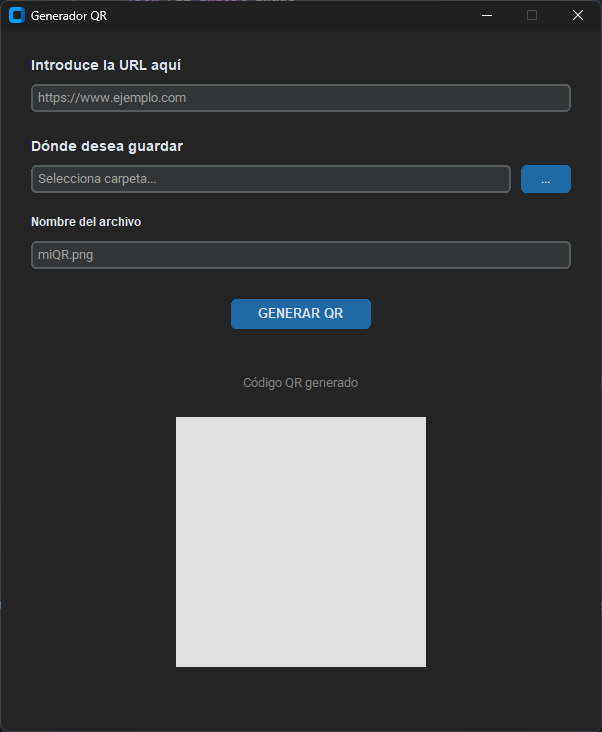

# 🚀 Generador de Códigos QR 

Una aplicación de escritorio para Windows que te permite generar un código QR a partir de cualquier URL y guardarlo donde quieras.

Construida con Python usando `CustomTkinter`.

---


---
## 📦 Uso (Ejecutable .exe)

1.  Ve a la sección de **"Releases"** en la barra lateral derecha de esta página de GitHub.
2.  Descarga el archivo `app.exe` de la última versión.
3.  Ejecútalo y úsalo.

## 💻 Directamente desde el código

1.  Clona el repositorio.
2.  Instala las dependencias:
    ```bash
    pip install -r requirements.txt
    ```
3.  Ejecuta la aplicación:
    ```bash
    python app.py
    ```